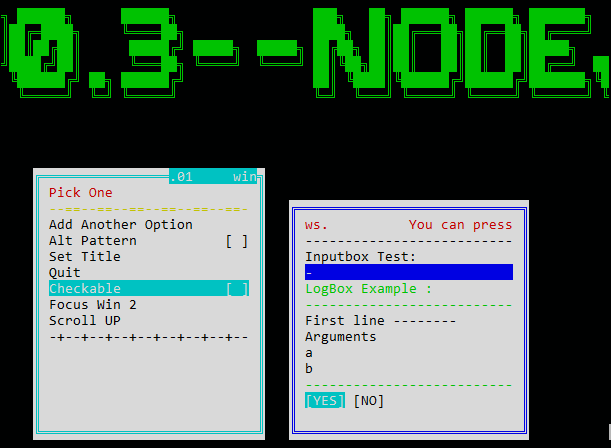

# djTUI

**Version:** 0.1\
**Author:** John Dimi, <johndimi@outlook.com>, twitter:[@jondmt](https://twitter.com/jondmt)\
**Language:** Haxe 3.4.7

**djTUI** is a Text User Interface with an agnostic renderer. Meaning that you can use it to whatever **HAXE** program you'd like as long as you **implement** the **output renderer** interface and the **input keys** interface.\
**e.g.** you can target both a real Terminal with nodeJS and a fake terminal on openFL using the same program codebase.

----------

### Features
- Work with Windows and Panels
- Various form elements, like checkboxes, inputfields, buttons, etc
- Easy to use callback system
- Can target any **HAXE** target, as long as you provide an interface for the renderer
- MORE TO COME

### :warning: This project is currently in heavy development and broken :warning:

