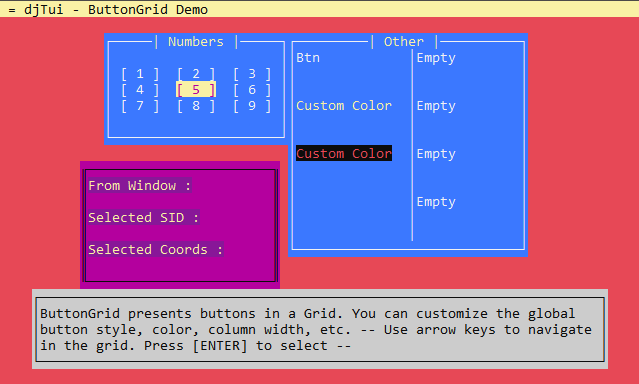

# DJTUI 

**License:** MIT, **Version:** 0.2, **Author:** John Dimi

**DJTUI** is a Terminal User Interface Library with a **platform agnostic** renderer and input manager. You can basically run this on whatever **HAXE** supports building to. From nodeJS, running on a real terminal, to openFL and heaps, etc.

- experimental , light and simple
- everything is an element and everything is inside a window. You can manipulate windows, move, open, close. etc
- easy event handling to windows and form elements
- Main Components:
  - **TextBox** put text inside a box, it will cut-off words automatically and supports scrolling
  - **Vertical List**, put hundreds of text elements in a scrollable list.
  - **Form Components**, basic components, like **inputbox**, **button**, **NumberSelector**,  **OptionSelector**, **ToggleBox**.
- Built-in **Styling** options. Offers some predefined color styles, but you can easily define your own styles and border styles.

  


## Visual Examples:

- Create forms, enter data presented in a form-like manner  

- Present information in textboxes and some user interaction  

- Create Grids where you can navigate with the arrow keys  

- Button Grid Demo  


>###  More examples in the source code 


## Engine :electric_plug:

### `WM`

The Window manager is the root of the engine. It manages and displays windows and it handles input keys either to navigate through windows or send commands to windows. There can be multiple open windows at once, but only one can be an **active** window, which will receive all user inputs.

#### WM contains
- `A` - **Align Tools**, use this object to quickly align windows to the screen or to other windows
- `T` - **Terminal**, if you want to directly draw characters to the terminal screen
- `D` - **Draw**,  provides some functions for drawing rectangles and grids on the screen
- `STATE` - **State Manager**, basic window state manager. Handles bundles of windows. Useful for creating multiple screens with separate windows
- `DB` - **Window Database**, Will automatically store windows based on their **SID** so you can retrieve them more quickly

### `Window`

A Window is just a container for child elements (*Base Elements, a special class that all window children must derive from*) A window has a width/height, has a screen position and can have custom styles, ( colors, border decoration, padding ). 


```haxe
// Simple window example
var win = new Window(60, 5);
win.title = "Example Window";
win.padding(1, 1);
win.addStack(new Label("This label element lives inside this window"));
WM.A.screen(win);
win.open();
```

> Calling `window.open()` will automatically make the `WM`  add the window and make it visible

### `BaseElement`

Base Elements are objects that will go inside a `window` This is a general class and everything that goes in a window must derive from that. All base elements callback messages to the parent window and/or the user by simple callbacks.

**Some base Elements in the library**

- Label
- Button
- Toggle
- Text Input
- Number Selector
- Option Selector
- Vertical List
- TextBox


## Examples

The included example project is ready to be compiled and run on both **nodeJS** ( running on a real Terminal ) and **openFL** ( which can pretty much run on anything )

- For a better understanding of `djTui` you can study the source code and example project, I have tried to provide meaningful comments in most places.
- Check the `example/readme.md` file for more info

## Interfaces
Currently djTUI comes with interfaces for 

- **nodeJS** 
- **openFL** (EXPERIMENTAL, PROOF OF CONCEPT, it works but it is not ideal)
- More interfaces are possible and easy to make. Just implement the generic interfaces `IInput.hx` and `ITerminal.hx`

## End Notes

- This was mostly developed for personal use and as a programming practice.  
- Checkout [PsxLauncher](https://github.com/johndimi/psxlauncher/) An open source emulation launcher that uses djTui
- This project is a low priority of mine. Perhaps I will come back to it in the future