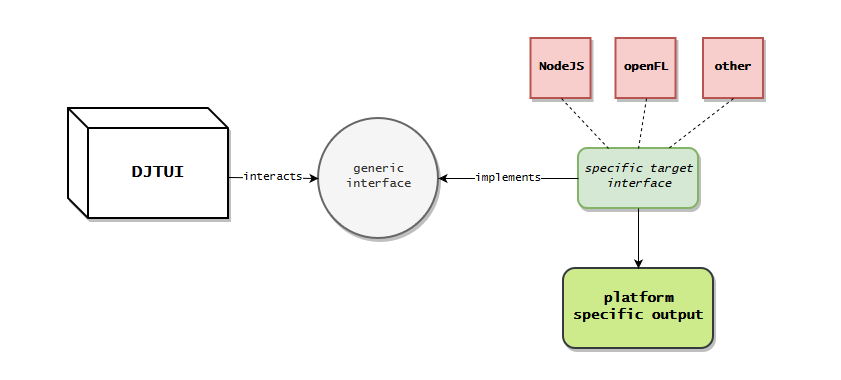
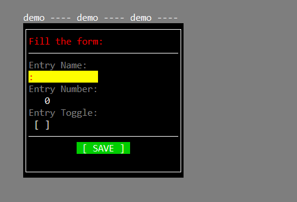
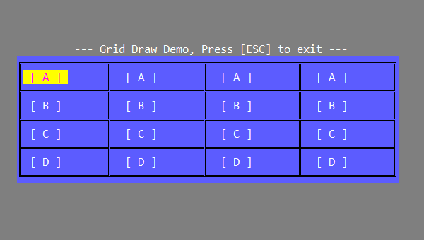
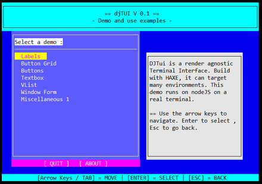

## DJTUI 

**Name**: djTUI *(Terminal User Interface Library)*\
**Author:** John Dimi, <johndimi@outlook.com>
**Project Page and Sources:** [https://github.com/johndimi/djTui](https://github.com/johndimi/djTui)\
**Language:** HAXE 4.1.3 , **License:** MIT\
**Version:** 0.1 **Platform:** Multiple 


## :question: What is it
**djTui** is a Terminal User Interface Library with a **platform agnostic** renderer and input manager. You can basically run this on whatever **HAXE** supports building to. From nodeJS, running on a real terminal, to openFL and openGL, etc.

>  :speech_balloon: **e.g.** You can target both a real Terminal with nodeJS and a fake terminal on openFL using the same program codebase.

djTUI provides some basic tools to create simple forms that allow data entry, selection and data presentation.




### Visual Examples:

- Create forms where you can enter data presented in a form-like manner


- Present information in textboxes and some user interaction


- Create Grids where you can navigate with the arrow keys


>### :notebook: More examples in the source code

## :electric_plug: Engine


### `WM`

The Window manager is the root of the engine. It manages and displays windows and it handles input keys either to navigate through windows or send commands to windows.

There can be multiple open windows at once, but only one can be an **active** window, which will receive all user inputs.

#### WM contains
- `A` - **Align Tools**, use this object to quickly align windows to the screen or to other windows
- `T` - **Terminal**, if you want to directly draw characters to the terminal screen
- `D` - **Draw**,  provides some functions for drawing rectangles and grids on the screen
- `STATE` - **State Manager**, basic window state manager. Handles bundles of windows. Useful for creating multiple screens with separate windows
- `DB` - **Window Database**, Will automatically store windows based on their **SID** so you can retrieve them more quickly

### `Window`

A Window is just a container for child elements (*Base Elements, a special class that all window children must derive from*) A window has a width/height, has a screen position and can have custom styles, ( colors, border decoration, padding ). 


```haxe
// Simple window example
var win = new Window(60, 5);
win.title = "Example Window";
win.padding(1, 1);
win.addStack(new Label("This label element lives inside this window"));
WM.A.screen(win);
win.open();
```

> Calling `window.open()` will automatically make the `WM` 

### `BaseElement`

Base Elements are objects that will go inside a `window` This is a general class and everything that goes in a window must derive from that. All base elements callback messages to the parent window and/or the user by simple callbacks.

All BaseElements can **callback** custom status messages to the user. (*on button pushes, on element focus/unfocus, etc*)


**Some base Elements in the library**

- Label
- Button
- Toggle
- Text Input
- Number Selector
- Option Selector
- Vertical List
- TextBox


## Examples

The included example project is ready to be compiled and run on both **nodeJS** ( running on a real Terminal ) and **openFL** ( which can pretty much run on anything )

- For a better understanding of `djTui` you can study the source code and example project, I have tried to provide meaningful comments in most places.
- Check the `example/readme.md` file for more info

### :star: Online demo is available :star:

[](https://johndimi.github.io/djTui/)
Click here to view the online demo *(Flash Required)*


## Starting UP

Depending on your build target, you must first initialize the global `WM` object, by giving it a renderer and input handler. e.g.
```haxe
WM.create(
	new nodeJSInput(), 	// Input interface
	new nodeJSTerminal(),   // Terminal interface
	80,40			// Terminal screen width/height
);
```
Then you can set optional `flags` or custom `styles`
```haxe
// Specify what the [TAB] key does
WM.set_TAB_behavior("WM", "keep");
// Set the background color for the whole terminal area
WM.backgroundColor = "darkblue";
// Set a global style for windows
WM.global_style_win = getCustomStyle_userFunction();
// .. and more ..
```
Then you can start creating windows. 
```haxe
// Create a specialized window that quickly creates lines of text
var win = new WindowLabel(['Hello World','from djTUI'],"center");
// place the window at x,y coordinates (5,10)
win.pos(5,10);
// Open the window. This will make it visible
win.open();
```
...

## Interfaces
Currently djTUI comes with interfaces for 

- **nodeJS** 
- **openFL**
- More interfaces are possible and easy to make. Just implement the generic interfaces `IInput.hx` and `ITerminal.hx`

## :arrow_forward: End notes