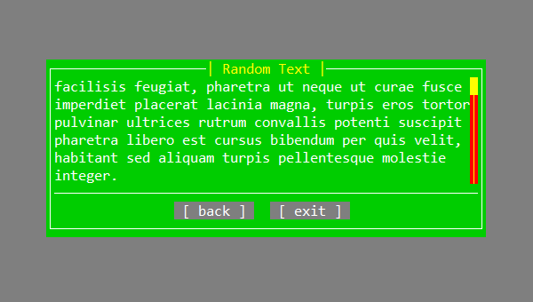
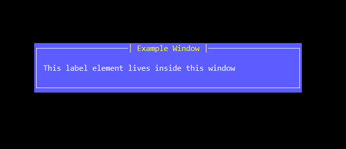

## DJTUI 

**Name**: djTUI *(Terminal User Interface Library)*\
**Author:** John Dimi, <johndimi@outlook.com> *twitter*: [@jondmt](https://twitter.com/jondmt)\
**Project Page and Sources:** [https://github.com/johndimi/djTui](https://github.com/johndimi/djTui)\
**Language:** HAXE 3.4.7, **Licence:** MIT\
**Version:** 0.1 **Platform:** Multiple 


## :warning: This readme is incomplete.


## :question: What is it
**djTui** is a Terminal User Interface Library with a **platform agnostic** renderer and input manager. You can basically run this on whatever **HAXE** supports building to. From nodeJS, running on a real terminal, to openFL and openGL, etc.

>  :speech_balloon: **e.g.** You can target both a real Terminal with nodeJS and a fake terminal on openFL using the same program codebase.

djTUI provides some basic tools to create simple forms that allow data entry, selection and data presentation.


### Visual Examples:

- Create forms where you can enter data presented in a form-like manner


- Present information in textboxes and some user interaction



## :electric_plug: Engine


### `WM`

The Window manager is the root of the engine. It manages and displays windows and it handles input keys either to navigate through windows or send commands to windows.

There can be multiple open windows at once, but only one can be an **active** window, which will receive all user inputs.

### `Window`

A Window is just a container for child elements (*Base Elements, a special class that all window children must derive from*) A window has a width/height, has a screen position and can have custom styles, ( colors, border decoration, padding ). 


```haxe
// Simple window example
var win = new Window(60, 5);
win.title = "Example Window";
win.padding(1, 1);
win.addStack(new Label("This label element lives inside this window"));
WM.A.screen(win);
win.open();
```

### `BaseElement`

Base Elements are objects that will go inside a `window` This is a general class and everything that goes in a window must derive from that. All base elements callback messages to the parent window and/or the user by simple callbacks.

**Some base Elements in the library**

- Label
- Button
- Toggle
- Text Input
- Number Selector
- Option Selector
- Vertical List
- TextBox


## :rocket: Help

Feel free to provide feedback and contact me on social media and email. Donations are always welcome! :smile:

[](https://www.paypal.me/johndimi)

Thanks for checking this out,\
John.
